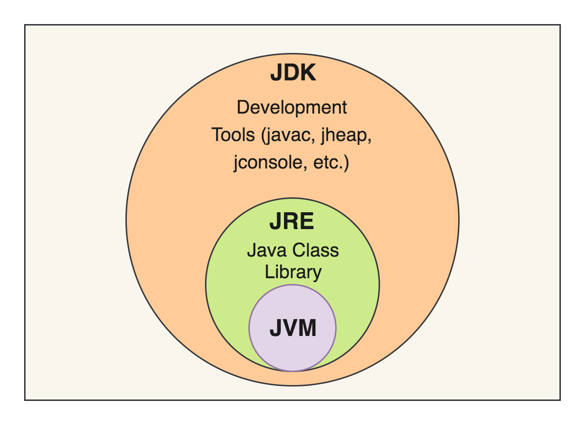

# Java Basics

## Topics Covered

- Introduction
- JVM
- JDK
- JRE
- Variables
- Data Types
- Operators
- Input Output

## What is Java?
Java is a high-level, class-based, object-oriented programming language that is designed to have as few implementation dependencies as possible. It is a general-purpose programming language intended to let application developers write once, run anywhere (WORA), meaning that compiled Java code can run on all platforms that support Java without the need for recompilation.

## JVM
Java Virtual Machine (JVM) is an abstract computing machine that enables a computer to run a Java program. It is a part of the Java Runtime Environment (JRE). The JVM performs the following main tasks:

<small>Source: *Medium*</small>

## JDK
Java Development Kit (JDK) is a software development environment used for developing Java applications and applets. It includes the Java Runtime Environment (JRE), an interpreter/loader (Java), a compiler (javac), an archiver (jar), a documentation generator (Javadoc), and other tools needed for Java development.

## Interview Questions

Q1. 

Q2.

Q3.

## Common Mistakes

- forgetting semicolon
- primitive vs wrapper confusion

## References

- Abdul Bari
- Oracle Documentation